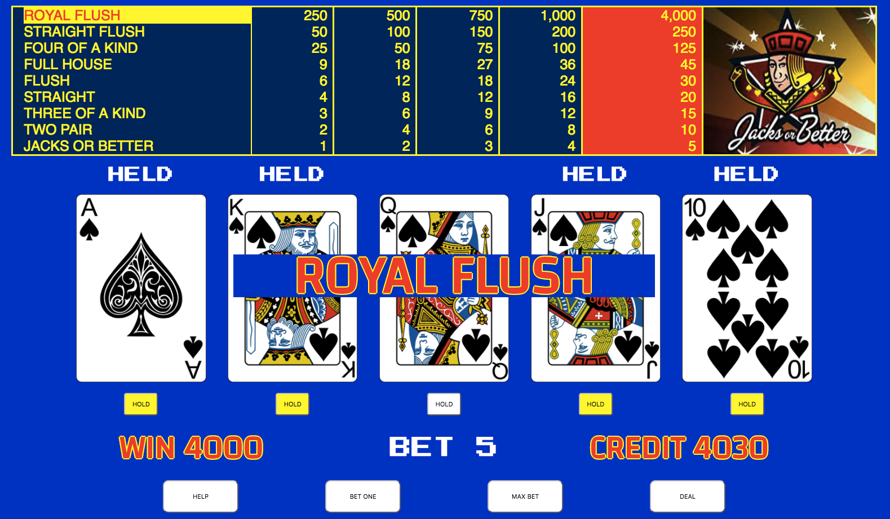

This is casino-style [Jacks or Better] video poker, built using React. The player
will start with 80 credits and has the option to play another 80 credits when out of money.

You can bet from one to five credits. Playing the max credits will pay out
the most on the Royal Flush, as shown in the pay table.

Hit the 'Deal' button to deal a newly shuffled hand. Hold the cards you want by
using the 'Hold' buttons below the cards, or simply touching or clicking directly
on the card. Then hit the 'Draw' button to draw the cards you want to replace in your hand.

This app utilizes the [poker-hands library], which contains most of the logic for
determining hand status in this game.

Play now on [Surge]. Have fun! :)

This project was bootstrapped with [Create React App]

[Jacks or Better]: https://wizardofodds.com/games/video-poker/tables/jacks-or-better/
[poker-hands library]: https://www.npmjs.com/package/poker-hands
[Surge]: http://jacks-or-better.surge.sh/
[Create React App]: https://github.com/facebookincubator/create-react-app
